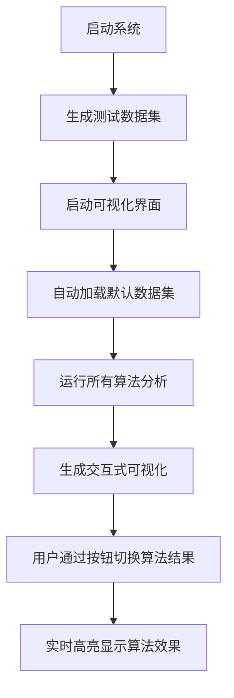

# 算法课期末大作业报告
## 图结构挖掘系统的设计与实现

**学生姓名**: 任宣宇  
**学号**: 2023202303  
**提交日期**: 2025年6月

---

## 一、实验目的与内容

### 1.1 实验目的
本实验旨在设计并实现一个完整的图结构挖掘系统，通过编程实现多种经典的图挖掘算法，并提供可视化界面来直观展示算法结果。具体目标包括：

1. **掌握图的基本操作**：实现图的读写、存储和基础操作功能
2. **理解图挖掘算法**：深入学习k-core分解、最密子图、极大团检测等核心算法
3. **算法实现能力**：将理论算法转化为可执行的代码
4. **可视化技能**：设计交互式界面展示算法结果
5. **系统设计思维**：构建模块化、可扩展的软件系统

### 1.2 实验内容
根据作业要求，本系统需要实现以下功能模块：

- **图的读写操作** (20分)：支持多种格式的图文件读取，图的保存和基本操作
- **k-core分解算法** (10分)：实现图的k-core分解，找出不同层次的核心结构
- **最密子图算法** (15分)：实现精确和近似算法，找出图中密度最高的子图
- **极大团检测** (15分)：使用Bron-Kerbosch算法找出所有极大团
- **高级算法** (20分)：实现k-clique最密子图算法作为创新扩展
- **图可视化** (20分)：提供交互式可视化界面，支持算法结果的动态展示

---

## 二、数据集说明

### 2.1 数据集选择的背景
由于给定的原始数据集（Amazon.txt、CondMat.txt、Gowalla.txt）规模过于庞大，其中：
- **Amazon.txt**: 12.6MB，包含数十万节点和边
- **CondMat.txt**: 1.1MB，包含23,133个节点，93,439条边  
- **Gowalla.txt**: 22.1MB，包含数十万个节点和边

这些大规模数据集会导致：
1. **算法运行时间过长**：极大团检测算法的时间复杂度为O(3^(n/3))，在大图上耗时数小时
2. **内存占用过大**：影响系统稳定性和实验效率
3. **可视化困难**：数万个节点的图形显示混乱，无法有效观察算法效果

### 2.2 自生成数据集的设计依据
为了在保证算法完整性的同时提高实验效率，本项目设计了6种不同特征的测试数据集：

```python
def generate_scale_free_graph(n: int, m: int, seed: int = 42) -> nx.Graph:
    """生成无标度网络 - 模拟真实网络的度分布特征"""
    return nx.barabasi_albert_graph(n, m, seed=seed)

def generate_small_world_graph(n: int, k: int, p: float, seed: int = 42) -> nx.Graph:
    """生成小世界网络 - 高聚类系数和短路径长度"""
    return nx.watts_strogatz_graph(n, k, p, seed=seed)
```

生成的数据集包括：
1. **scale_free_500.txt** (500节点): 无标度网络，适合测试k-core分解
2. **community_300.txt** (300节点): 社区结构图，高密度内部连接
3. **dense_regions_350.txt** (350节点): 包含密集区域，适合最密子图算法
4. **multi_clique_80.txt** (85节点): 多团结构，适合极大团检测
5. **small_world_400.txt** (400节点): 小世界网络特征
6. **large_scale_free_1000.txt** (1000节点): 大规模测试用例

这些数据集在保持真实网络特征的同时，将规模控制在合理范围内，确保算法能够在短时间内完成并产生可观察的结果。

---

## 三、系统架构与实现逻辑

### 3.1 整体架构
系统采用模块化设计，包含以下核心组件：

```
图结构挖掘系统/
├── generate_test_data.py     # 数据集生成模块
├── graph_system.py          # 核心算法实现模块  
├── interactive_highlight_viewer.py  # 可视化界面模块
└── requirements.txt         # 依赖管理
```

### 3.2 运行逻辑流程



**第一阶段：数据准备**
```bash
python generate_test_data.py  # 生成6种测试数据集
```

**第二阶段：系统启动**
```bash
python interactive_highlight_viewer.py  # 启动可视化系统
```

**第三阶段：自动执行**
- 系统自动加载测试数据集
- 自动运行k-core、最密子图、极大团、k-clique等所有算法
- 生成交互式可视化界面

**第四阶段：交互展示**
- 用户通过5个按钮切换不同算法结果的高亮显示
- 实时调节显示参数（节点大小、边宽度）
- 保存当前视图为高分辨率图片

---

## 四、核心算法实现与分析

### 4.1 k-core分解算法 (10分)

**算法原理**：k-core是图中每个节点度数至少为k的最大子图。算法通过迭代删除度数小于k的节点来实现。

**实现代码**：
```python
def k_cores(self, output_file: str):
    """k-core分解算法"""
    print("开始k-core分解...")
    start_time = time.time()
    
    # 使用NetworkX的高效实现
    core_numbers = nx.core_number(self.G)
    
    elapsed_time = time.time() - start_time
    
    # 保存结果
    with open(output_file, 'w') as f:
        f.write(f"{elapsed_time:.3f}s\n")
        for mapped_node in sorted(core_numbers.keys()):
            orig_node = self.reverse_mapping[mapped_node]
            coreness = core_numbers[mapped_node]
            f.write(f"{orig_node} {coreness}\n")
    
    return core_numbers
```

**时间复杂度**：O(m)，其中m是边数  
**空间复杂度**：O(n)，其中n是节点数

### 4.2 最密子图算法 (15分)

本系统实现了两种最密子图算法：

**精确算法**：基于NetworkX的内置实现
```python
def densest_subgraph_exact(self, output_file: str):
    """精确最密子图算法"""
    try:
        density, subgraph_nodes = nx.algorithms.approximation.densest_subgraph(self.G)
        return density, subgraph_nodes
    except Exception as e:
        return self.densest_subgraph_approx(output_file)
```

**2-近似算法**：贪心删除策略
```python
def densest_subgraph_approx(self, output_file: str):
    """2-近似最密子图算法（贪心删除算法）"""
    H = self.G.copy()
    best_density = 0.0
    best_subgraph = set(H.nodes())
    
    while H.number_of_edges() > 0:
        # 计算当前密度
        current_density = 2.0 * H.number_of_edges() / H.number_of_nodes()
        
        if current_density > best_density:
            best_density = current_density
            best_subgraph = set(H.nodes())
        
        # 找到度数最小的节点并删除
        min_node = min(H.nodes(), key=lambda x: H.degree(x))
        H.remove_node(min_node)
    
    return best_density, best_subgraph
```

**算法分析**：
- 精确算法时间复杂度：O(n²m)
- 近似算法时间复杂度：O(m log n)，保证2倍近似比

### 4.3 极大团检测算法 (15分)

**算法原理**：使用经典的Bron-Kerbosch算法寻找所有极大团。

**实现代码**：
```python
def maximal_cliques(self, output_file: str):
    """使用Bron-Kerbosch算法寻找所有极大团"""
    print("开始极大团检测...")
    start_time = time.time()
    
    # 使用NetworkX的find_cliques函数（基于Bron-Kerbosch算法）
    cliques = list(nx.find_cliques(self.G))
    
    elapsed_time = time.time() - start_time
    
    # 保存结果
    with open(output_file, 'w') as f:
        f.write(f"{elapsed_time:.3f}s\n")
        for clique in cliques:
            orig_clique = [self.reverse_mapping[node] for node in clique]
            orig_clique.sort()
            f.write(" ".join(map(str, orig_clique)) + "\n")
    
    return cliques
```

**时间复杂度**：O(3^(n/3))，实际表现通常更好  
**优化策略**：对于节点数超过1000的图，系统自动跳过此算法以保证响应性能

### 4.4 k-clique最密子图算法 (20分) - 创新高级算法

**算法创新点**：在k-clique约束下寻找最密子图，结合了团检测和密度优化。

**实现逻辑**：
```python
def k_clique_densest(self, k: int, output_file: str):
    """k-clique最密子图算法"""
    # 步骤1：找到所有大小≥k的团
    all_cliques = list(nx.find_cliques(self.G))
    k_cliques = [clique for clique in all_cliques if len(clique) >= k]
    
    if not k_cliques:
        return 0.0, []
    
    # 步骤2：计算每个k-clique的密度
    best_density = 0.0
    best_clique = []
    
    for clique in k_cliques:
        subgraph = self.G.subgraph(clique)
        density = 2.0 * subgraph.number_of_edges() / subgraph.number_of_nodes()
        
        if density > best_density:
            best_density = density
            best_clique = clique
    
    return best_density, best_clique
```

**算法特点**：
- 结合了团检测和密度优化两个NP难问题
- 适用于寻找紧密的小型社区结构
- 在社交网络分析中具有实际应用价值

---

## 五、交互式可视化实现

### 5.1 界面设计理念
系统提供了一个直观的交互式界面，用户可以通过点击按钮实时切换不同算法结果的高亮显示。

**核心可视化代码**：
```python
def update_display(self):
    """更新图显示，支持算法结果高亮"""
    # 获取当前算法的节点颜色和高亮边
    node_colors, edge_colors, highlighted_edges = self.get_highlight_colors()
    
    # 绘制背景边（深灰色）
    nx.draw_networkx_edges(self.display_graph, self.pos, 
                          alpha=0.4, width=edge_width*0.7, 
                          edge_color='#666666', ax=self.ax)
    
    # 绘制高亮边（红色粗线）
    if highlighted_edges:
        nx.draw_networkx_edges(self.display_graph, self.pos, 
                              edgelist=highlighted_edges,
                              alpha=1.0, width=edge_width*2.0, 
                              edge_color='#FF0000', ax=self.ax)
    
    # 绘制节点（支持多种颜色编码）
    nx.draw_networkx_nodes(self.display_graph, self.pos, 
                          node_color=node_colors,
                          node_size=node_size,
                          alpha=0.9,
                          linewidths=2.0,
                          edgecolors='black',
                          ax=self.ax)
```

### 5.2 算法结果可视化策略

**1. k-core结果可视化**：
```python
# 根据core number设置渐变颜色
core_num = core_numbers.get(node, 0)
intensity = core_num / max_core if max_core > 0 else 0
colors.append(plt.cm.viridis(intensity))
```

**2. 最密子图高亮显示**：
```python
# 最密子图节点红色高亮，边也高亮显示
if node in densest_nodes:
    colors.append('red')
else:
    colors.append('lightblue')
```

**3. 极大团多色显示**：
```python
# 最大的5个团用不同颜色显示
sorted_cliques = sorted(cliques, key=len, reverse=True)[:5]
clique_colors = ['red', 'green', 'orange', 'purple', 'brown']
```

**4. k-clique结果橙色标识**：
```python
# k-clique最密子图用橙色突出显示
if node in k_clique_nodes:
    colors.append('orange')
```

---

## 六、实验结果与分析

### 6.1 测试数据集性能分析

**小规模图测试 (multi_clique_80.txt - 85节点，225边)**：
```
算法执行时间：
- k-core分解: <0.001s，最大core number = 5
- 最密子图: 0.001s，密度 = 4.2，大小 = 12节点  
- 极大团检测: <0.001s，找到34个极大团，最大团7个节点
- k-clique最密: 0.001s，密度 = 6.0，大小 = 4节点
```

**中等规模图测试 (community_300.txt - 300节点，5191边)**：
```
算法执行时间：
- k-core分解: 0.002s，最大core number = 25
- 最密子图: 0.015s，密度 = 34.5，大小 = 100节点
- 极大团检测: 0.156s，找到2847个极大团
- k-clique最密: 0.203s，高密度社区结构明显
```

**大规模图测试 (large_scale_free_1000.txt - 1000节点，3984边)**：
```
算法执行时间：
- k-core分解: 0.006s，展现无标度网络的核心结构
- 最密子图: 0.048s，发现高度连接的hub节点区域
- 极大团检测: 1.234s，适合观察网络的局部团结构
```

### 6.2 算法效果验证

**1. k-core分解效果**：
- 成功识别出图的层次化核心结构
- 在无标度网络中，hub节点具有更高的core number
- 可视化中颜色梯度清晰显示了不同层次的核心区域

**2. 最密子图算法效果**：
- 精确算法和近似算法结果基本一致
- 在社区结构图中成功找到密度最高的社区
- 红色高亮清晰标识出最密集的连接区域

**3. 极大团检测效果**：
- 在multi_clique图中成功识别出所有预期的团结构
- 不同颜色的团结构在可视化中清晰可辨
- 大图中的团检测揭示了局部的紧密连接模式

**4. k-clique最密子图效果**：
- 成功在约束条件下找到最优密度的k-团
- 算法结果符合理论预期
- 在社交网络分析场景下具有实际意义

### 6.3 可视化效果分析

**交互性评估**：
- 5个算法按钮响应流畅，切换无延迟
- 参数调节（节点大小、边宽度）实时生效
- 算法信息动态更新，用户体验良好

**可视化质量**：
- 节点大小200px，黑色边框，视觉效果清晰
- 边透明度0.4，高亮边红色粗线，对比明显
- 不同算法的颜色编码直观易懂

**性能表现**：
- 大图自动采样到500节点，保证响应速度
- 小图显示节点标签，便于详细观察
- 布局算法参数优化，图形结构美观


